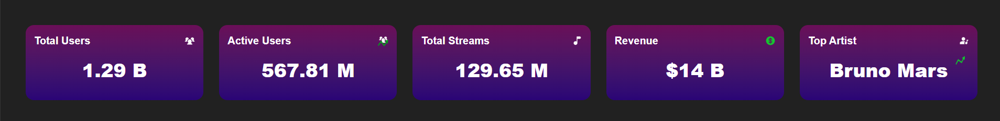
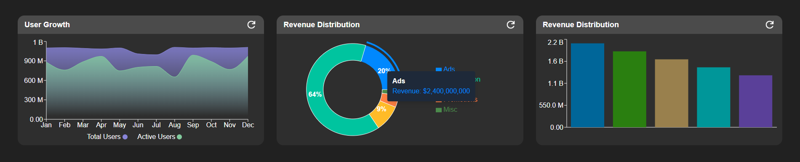
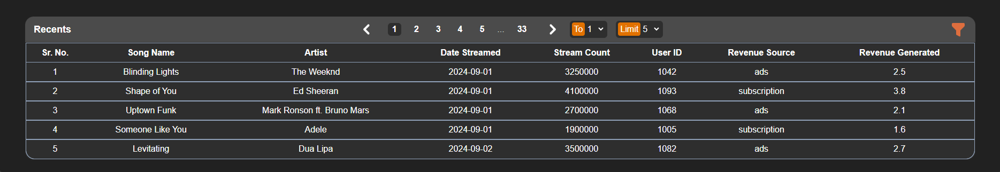
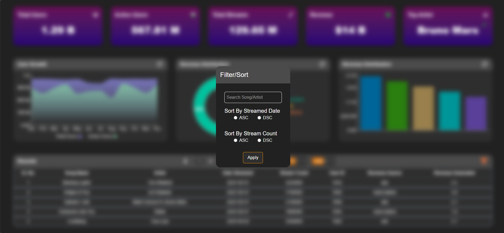

# Streamify Dashboard

A PoC analytics dashboard for music streaming service displaying 3-key sections:

- Key Metric
- Data Visualization
- Data Table

### Demo

<video controls src="https://github.com/user-attachments/assets/24959c74-85a8-4c5c-8abe-0a697da5a10f" title="Streamify Demo"></video>

## Technologies Used

- TypeScript
- React
- Tailwind
- Recharts
- Swiper

## Installation
- ```
    git clone https://github.com/nay-22/Streamify-Dashboard.git
    ```
- **Open two terminals**
  - On one terminal
    - ```
        cd Streamify-backend
        ```
    - ```
        npm install
        ```
    - ```
        npm run dev
        ```
  - On other terminal
    - ```
        cd Streamify-frontend
        ```
    - ```
        npm install
        ```
    - ```
        npm run dev
        ```
- Open the following link on browser
  [http://localhost:5173](http://localhost:5173)

## Key Features

### Custom ThemeProvider

- Wrap components using
    ```js
    // Conditionally pass light/dark themes as value based on the current mode
    <ThemeProvider value={themeMode === ThemeMode.LIGHT ? lightTheme : darkTheme}>
        <Dashboard />
    </ThemeProvider>
    ```

- Uses Custom ThemeOptions to simplify theming. The values then can be passed as properties to style for inline CSS or use in class for tailwindcss.
    ```js
    export type ThemeType = {
        primary?: string | undefined,
        secondary?: string | undefined,
        tertiary?: string | undefined,
        accent?: string | undefined,
    };
    
    export interface BaseThemeOptions {
        text?: ThemeType | undefined;
        background?: ThemeType | undefined;
    }
    
    export interface ThemeOptions extends BaseThemeOptions {
        error?: BaseThemeOptions | undefined;
    }
    ```

### Custom Hooks

- **useFetch(...)<T, S extends QueryOptions>**
  - Dynamically fetches responses when query changes.
  - Exposes the following properties,
    ```js
    export type FetchRequest<S, T> = {
        data: T | undefined,
        query: S | undefined,
        refetch: () => void,
        addQuery: (query: S) => void,
        deleteQuery: (key: string) => void,
        updateQuery: (key: string, value: string | number) => void,
        isLoading: boolean,
        error: string | null,
    };
    ```

### Higher Order Components

- **withLoaderAndError**
  - Accepts a component (ideally one that would make a network/async operation) and conditionally renders loader, error, or the component.
  - Must accept isLoading(boolean) & error(string) as props.
    ```js
    export interface WithLoaderAndErrorProps {
        isLoading: boolean;
        error?: string | null;
    }

    // A component might accept props as follows
    export interface DataTableProps extendsWithLoaderAndErrorProps {
        currPage?: number | undefined;
        limit?: number | undefined;
        data?: RecentStreams | undefined;
        tableRef: RefObject<HTMLTableElement>;
    }

    // Then wrap the component with the HOC
    const DataTable = ({ currPage, limit, data,tableRef }: DataTableProps) => {
         return <>...</>
    }
    export default withLoaderAndError(DataTable);
    ```

### Lazy Loading
- Filter form is loaded lazily to a modal only when filter icon is clicked.

## Section-wise features

### Key Metric

- Fully dynamic Card render based on Metric attributes from API response.
- Config-based response from API enables scalable rendering.
- Wrapped using carousel components from Swiper to enable responsive design.
- Key Metrics wrapped using withLoaderAndError HOC for auto loading/error handling.



### Data Visualization

- Visualize multiple data metrics using different charts.
- Charts support custom tooltips and/or legends for better readability.
- Charts wrapped using withLoaderAndError HOC for auto loading/error handling.



### Recents Table

- A table that lists detailed information about recent streams.
- Supports fully responsive paginator with ability to skip to a page and set custom page limits.
- Supports basic filter/sorting via a form tha is lazily loaded to a modal when cliked on the filter icon.



